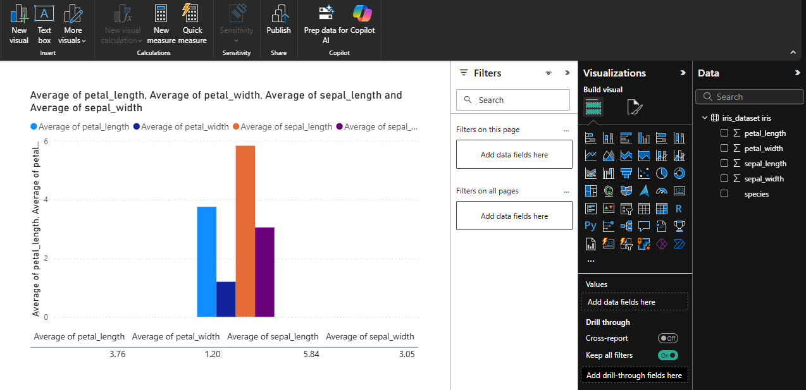
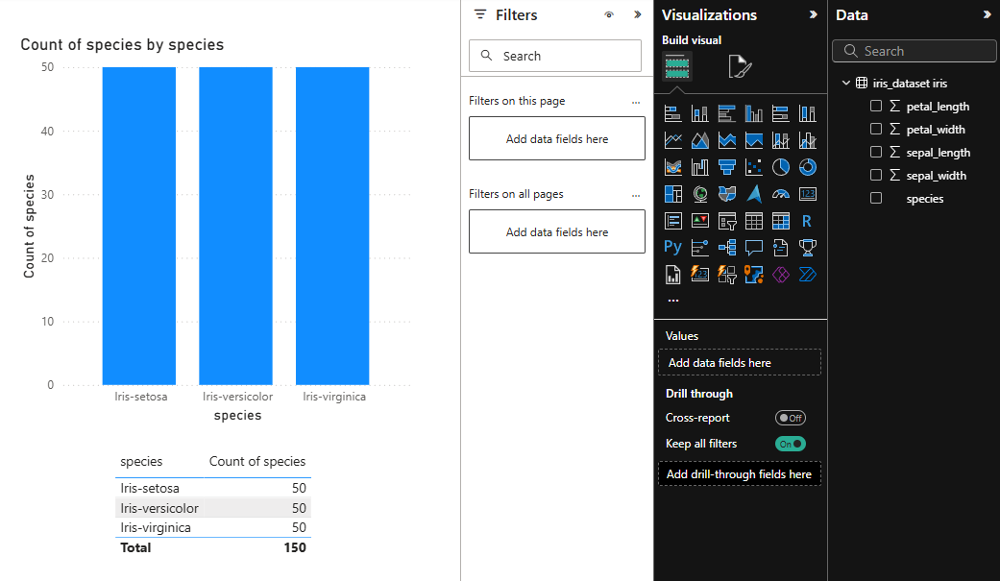

# Eksplorasi Data

## 1. Statistik Deskriptif Dasar

### 1.1 Min-Max Setiap Kolom

**Hasil Analisis**:
- **sepal_length**: 4.3 - 7.9 cm (range: 3.6 cm)
- **sepal_width**: 2.0 - 4.4 cm (range: 2.4 cm)
- **petal_length**: 1.0 - 6.9 cm (range: 5.9 cm)
- **petal_width**: 0.1 - 2.5 cm (range: 2.4 cm)

**Insight**: Petal length memiliki variasi terbesar (5.9 cm), menunjukkan karakteristik yang paling beragam antar spesies.

### 1.2 Rata-rata Setiap Kolom

**Hasil Analisis**:
- **sepal_length**: ~5.84 cm 
- **sepal_width**: ~3.05 cm 
- **petal_length**: ~3.76 cm 
- **petal_width**: ~1.20 cm 

**Insight**: Sepal umumnya lebih besar dari petal, dengan width selalu lebih kecil dari length.

### 1.3 Jumlah Setiap Kelas

**Hasil**:
- Iris-setosa: 50 sampel (33.33%)
- Iris-versicolor: 50 sampel (33.33%)
- Iris-virginica: 50 sampel (33.33%)

**Insight**: Dataset perfectly balanced - tidak ada bias kelas, ideal untuk machine learning.

### 1.4 Median Setiap Kolom

**Hasil Analisis**:
- **sepal_length**: ~5.80 cm (mendekati mean, distribusi simetris)
- **sepal_width**: ~3.00 cm (mendekati mean, distribusi normal)
- **petal_length**: ~4.35 cm (lebih besar dari mean, skew ke kiri)
- **petal_width**: ~1.30 cm (lebih besar dari mean, skew ke kiri)

**Insight**: Petal measurements cenderung skewed karena perbedaan besar antara Iris-setosa dengan spesies lainnya.

### 1.5 Variance Setiap Kolom

**Hasil Analisis**:
- **sepal_length**: ~0.69 cm² (variance sedang)
- **sepal_width**: ~0.19 cm² (variance rendah)
- **petal_length**: ~3.10 cm² (variance tertinggi)
- **petal_width**: ~0.58 cm² (variance sedang)

**Insight**: Variance menguatkan temuan bahwa petal length memiliki dispersi data terbesar antar spesies.

### 1.6 Standard Deviasi Setiap Kolom

**Hasil Analisis**:
- **sepal_length**: ~0.83 cm (variabilitas sedang)
- **sepal_width**: ~0.43 cm (variabilitas rendah)
- **petal_length**: ~1.76 cm (variabilitas tinggi)
- **petal_width**: ~0.76 cm (variabilitas sedang-tinggi)

**Insight**: Petal length memiliki variabilitas tertinggi, mengkonfirmasi bahwa ini adalah feature yang paling diskriminatif.

## 2. Analisis Statistik Lanjutan

### 2.1 Tabel Ringkasan Statistik Lengkap

| Statistik | sepal_length | sepal_width | petal_length | petal_width |
|-----------|--------------|-------------|--------------|-------------|
| **Mean/Rata-Rata** | 5.84 | 3.05 | 3.76 | 1.20 |
| **Median** | 5.80 | 3.00 | 4.35 | 1.30 |
| **Std Dev** | 0.83 | 0.43 | 1.76 | 0.76 |
| **Variance** | 0.69 | 0.19 | 3.10 | 0.58 |
| **Min** | 4.30 | 2.00 | 1.00 | 0.10 |
| **Max** | 7.90 | 4.40 | 6.90 | 2.50 |
| **Range** | 3.60 | 2.40 | 5.90 | 2.40 |

### 2.2 Coefficient of Variation (CV)

**Rumus**: CV = (Standard Deviation / Mean) × 100%

**Hasil Analisis**:
- **sepal_length**: ~14.2% (variabilitas rendah-sedang)
- **sepal_width**: ~14.1% (variabilitas rendah-sedang)
- **petal_length**: ~46.8% (variabilitas sangat tinggi)
- **petal_width**: ~63.3% (variabilitas tertinggi)

**Insight**: Petal width memiliki variabilitas relatif tertinggi, menjadikannya feature yang sangat informatif untuk klasifikasi.
